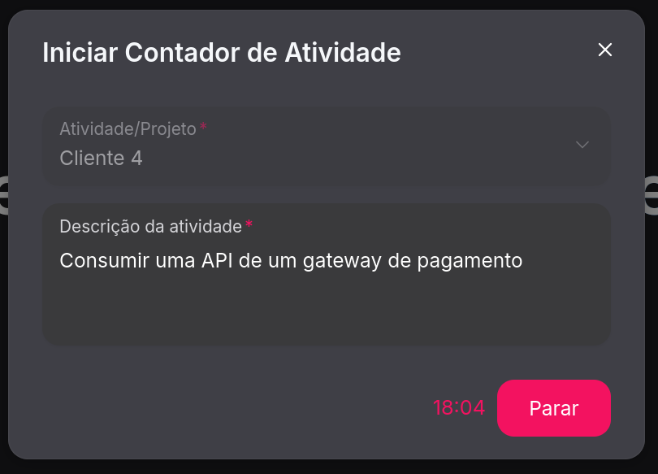
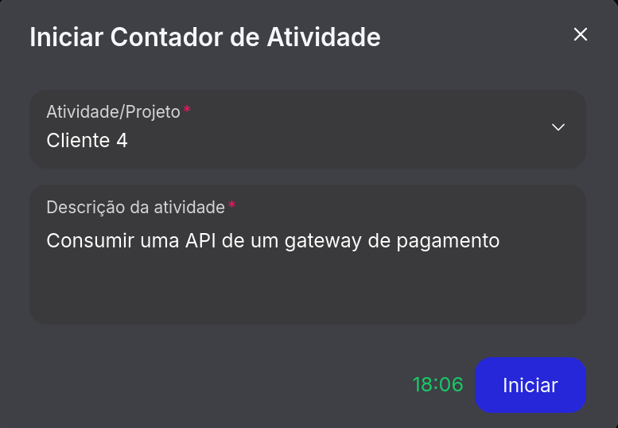

# ChronosWork

# Sumário
- [Sobre](#Sobre)
- [Como testar o projeto?](#como-testar-o-projeto)
- [Rodar local](#rodal-local)
	- [Pré-requisitos](#pré-requisitos)
	- [Instalação](#instalação)

# Sobre 

Este projeto foi construído com Next.JS, Typescript, NextUI e Tailwind CSS.

O intuito do projeto é realizar o registro de atividades e gestão dos colaboradores de uma empresa. 

# Como testar o projeto?

Você pode acessar o site em: https://chronos-work.vercel.app/

Cada usuário terá seu acesso, que poderá ser de acesso de colaborador ou acesso de gestor. 

O site inteiro é ligado à uma planilha do google, e só pode ser cadastrado um novo usuário por meio dela.


[Clique aqui para acessar a planilha](https://docs.google.com/spreadsheets/d/13rBpIoIKqcoNdXkT16BmzSK11WaKQfQIcmEmDOZmaPA/edit?gid=569383495#gid=569383495)

Após o primeiro acesso as informações do usuário ficam salvas no navegador, sem necessidade de fazer o login sempre que acessar o site.

Agora imagine que você é um colaborador que trabalha como desenvolvedor e vai iniciar uma nova task. 

Você deverá acessar o site com o seu login e após isso registrar a task que você vai começar. Para isso, clique no botão com o texto "Clique aqui".


---

Após isso, irá abrir uma janela com um formulário, onde você deverá preencher de acordo com sua task.


---

Depois de preencher, clique no botão "Iniciar". Após o clique, o site pegará a sua data e horário automaticamente e exibirá o horário ao lado do botão "Parar".



---

Agora você deverá realizar a sua tarefa normalmente. Após o término, deverá voltar no site e clicar em "Parar". Pra confirmar que parou, o site mostrará o horário de término em verde, ao lado do botão "Iniciar". Após isso, você pode fechar a janela (Caso você queira iniciar uma nova atividade, basta preencher novamente o formulário e clicar no botão novamente).



---

*Após a etapa do contador de atividades, note que a pagina de atividades do usuario foi prenchida automaticamente:*


---

Agora, caso queira visualizar as últimas atividades cadastradas, é possível utilizar a barra de navegação e clicar em "Relatório".


*Aqui será exibido as ultimas 31 atividades do colaborador, contando com diversas opções de filtro. Após o carregamento da tabela de dados, você terá algo assim:*


*Note que temos novas funcionalidades nessa página, como "Adicionar novo" e "Criar relatório".*

Caso você tenha se esquecido de cadastrar alguma de suas tarefas, você pode inserir uma nova manualmente com o botão "Adicionar novo"

Ele irá abrir uma nova janela, onde você poderá inserir todos os dados da task manualmente:


Agora falando sobre o botão "Criar relatório", ao clicar nele, você será redirecionado para uma página que gera um relatório com gráficos de acordo com suas últimas 31 atividades. Antes de demonstrar no print, eu cadastrei novas atividades para ficar mais compreensível:


Os números em baixo se referem a quantidade de horas. Por exemplo o cliente 5 gastou 1 hora de desenvolvimento, já o cliente 6 gastou 5,5 horas (5 horas e 30 minutos).

Ao passar o mouse em cima da barra de algum cliente, podemos ver exatamente quantas horas foram gastas por ele, sem a necessidade de fazer a leitura do gráfico.

Nessa página, temos o botão "Baixar PDF". Com ele, você pode gerar um pdf com esse gráfico, tendo a opção de imprimir ou salvá-lo no seu computador.


E essa foram as funcionalidade caso você faça login como colaborador.

Agora, caso você faça o login como gestor, você poderá fazer tudo que o colaborador faz, porém terá uma única diferença:

- Ao acessar a página "Relatório", você deverá escolher o colaborador do qual quer visualizar as atividades. Tendo assim a possibilidade verificar as atividades e gerar um relatório de qualquer um colaborador. 


Em breve planejo incrementar uma nova funcionalidade, onde o gestor poderá gerar um pdf com as atividades do time inteiro.

E é isso, essas foram todas as funções :)

Lembrando que você mesmo pode realizar o teste no site hospedado: https://chronos-work.vercel.app/

Para obter o acesso para o login, acesse a planilha e vá até a aba "DevsLogin".

[Clique aqui pra acessar a planilha](https://docs.google.com/spreadsheets/d/13rBpIoIKqcoNdXkT16BmzSK11WaKQfQIcmEmDOZmaPA/edit?gid=569383495#gid=569383495)

# Rodar local:

## Pré-requisitos

Antes de rodar o projeto, você precisa ter o seguinte instalado:

- [Node.js](https://nodejs.org) (versão 16 ou superior)
- [npm](https://www.npmjs.com/) ou [yarn](https://yarnpkg.com/)

## Instalação

Para começar, clone o repositório:

```bash
git clone https://github.com/LuisFelipeMod/luisfelipemod.github.io.git
cd luisfelipemod.github.io
```

Instale as dependências:

```bash
npm install
# ou, se preferir usar o Yarn:
# yarn install
```

Agora, para rodar o projeto localmente:

```bash
npm run dev
# ou, se estiver usando o Yarn:
# yarn dev
```
O site estará disponível em http://localhost:3000.

<sub>Ou acesse o site em produção: https://chronos-work.vercel.app</sub>

